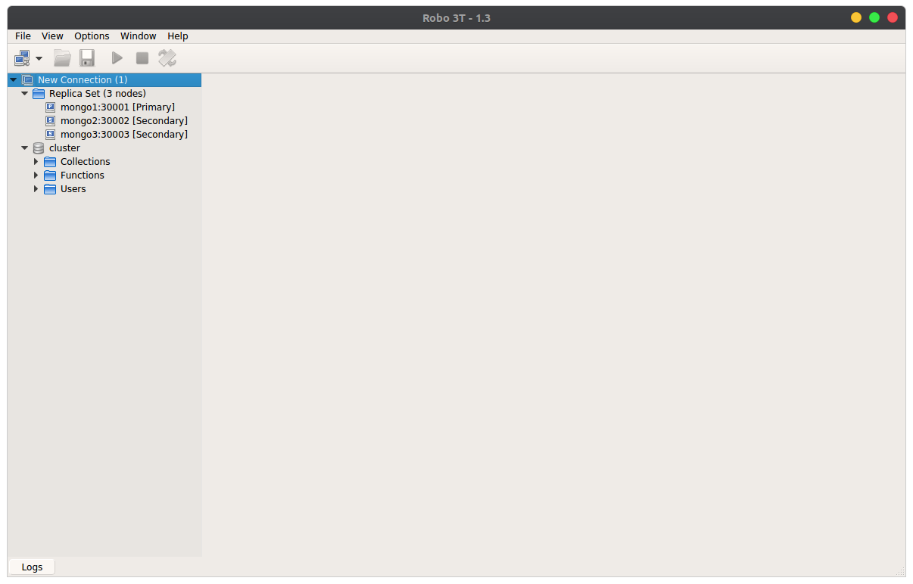

<p align="center">
  

  <h3 align="center">MongoDB Replica set using Docker</h3>

  <p align="center">
   A replica set in MongoDB is a group of mongod processes that maintain the same data set .
  </p>
</p>

## More Details

https://docs.mongodb.com/manual/replication/


### Installation

1. Clone the repo
    ```sh
    git clone https://github.com/civilcoder55/MongoReplica.git
    ```

2. update env file 

3. Create file.key using linux commands

    ```sh
    openssl rand -base64 700 > scripts/file.key
    chmod 400 scripts/file.key
    sudo chown 999:999 scripts/file.key
    ```

4. Update hostnames (add this line to "/etc/hosts" in linux or "C:\Windows\System32\drivers\etc\hosts" in windows )

    ```sh
    127.0.0.1       mongo1 mongo2 mongo3
    ```


5. Run containers
    ```sh
    sudo docker-compose up -d 
    ```

6. Connect to replica set from any mongo client using uri
    ```sh
    "mongodb://<MONGO_INITDB_USERNAME>:<MONGO_INITDB_PASSWORD>@mongo1:30001,mongo2:30002,mongo3:30003/<MONGO_INITDB_DATABASE>?replicaSet=rs0"
    ```


<p align="center">
  
</p>
